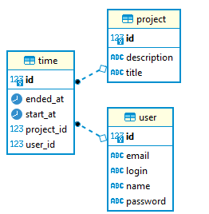

# Time allocation project
A system to report working hours on associated projects.

## Mission
### Target public
* The application is aimed at professionals who need to point out hours of work in associated projects.
### Scope evaluation
The system context is made up of three basic entities user, project and time. The following relationships being informed:
- Users have projects;
- Projects have registered working times;
- A user has multiple projects;
- A project has multiple users;
- A project has multiple times recorded;
- A registered time only has one associated project;
- A time has a user;

Thus featuring a many-to-many relationship between user and project. This relationship is the entity 'time', thus being characterized as a entity-relationship.

### Entity–relationship model


The user entity has the following attributes:
- name: STRING,
- email: STRING,
- login: STRING,
- password: STRING (This field has been obfuscated in the database for sensitive data security reasons)

The project entity has the following attributes:
- title: STRING,
- description: STRING,

The time entity has the following attributes:
- startedAt: DATETIME,
- endedAt: DATETIME
- and is associating with the user and project entities.

### Development estimation
|                        Activity                              | Estimate in hours |
|------------------------------------------------------------|:-------------------:|
| Scope   understanding                                        | 1                 |
| Initial   project definitions                                | 2                 |
| Entity   layer creation                                      | 2                 |
| Creation   of controller layer for user entity               | 3                 |
| Creation   of controller layer for project and time          | 6                 |
| Creation Business   Rule Layer                               | 6                 |
| Creating   the repository layer                              | 4                 |
| Creating   security by authentication                        | 8                 |
| Documentation                                                | 2                 |
| Total estimated hours                                        | ***34***                |

### Test estimation
|                        Activity                              | Estimate in hours |
|------------------------------------------------------------|:-------------------:|
| Automated Integration Tests                                | 20                  |
| Manual tests using the Postman tool                        | 4                   |
| Total estimated hours                                      | ***24***                  |

#### Estimated dead line
* Estimated delivery of the system is ***7 days***. ***Considering a day as 8 hours of work***.

## Technological information

#### Dependencies
* Java 8
* Spring Boot and Spring MVC
* Postgres and Spring Data JPA
* Unit tests with JUnit
* Lombok
* Docker (optional)

### Setup by Docker
* The docker-compose.yml file contains the resources needed to run the project.
* To create the resources run the command: [docker-compose up](https://docs.docker.com/compose/reference/up/)
* To remove features run the command: [docker-compose down](https://docs.docker.com/compose/reference/down/)

### How to run the application by Eclipse
* [Clone the project](http://git.vibbra.com.br/rafael-1624318740/time-allocation-project.git)
* [Import the maven project into eclipse](lagomframework.com/documentation/1.6.x/java/EclipseMavenInt.html)
```
Right click on the > 'TimeAllocationProjectApplication.java' class > Run as > Java application
```

### How to run the application by Maven
* Open terminal console and 
* Run the following commands
```
git clone http://git.vibbra.com.br/rafael-1624318740/time-allocation-project.git
cd time-allocation-project
./run.cmd
```

### RESTful API details
```
http://<HOST>:8080/swagger-ui.html#/
```

### DEPLOY
- Deploy on [heroku](https://devcenter.heroku.com/articles/deploying-spring-boot-apps-to-heroku): https://dry-island-48440.herokuapp.com/swagger-ui.html#/
- Default user credentials: login: admin / password: password

### Postman collection
* It is possible to interact with the APIs using the [Postman tool](https://www.postman.com/). Just [import](https://kb.datamotion.com/?ht_kb=postman-instructions-for-exporting-and-importing) the [collection and environment variables](http://git.vibbra.com.br/rafael-1624318740/time-allocation-project/-/tree/master/postman).

### TIPS
* If your eclipse show not recognize the getters and setts, please see [how install lombok library](https://stackoverflow.com/questions/45461777/lombok-problems-with-eclipse-oxygen) 
* If the unit tests not working, please see the solutions [here](https://stackoverflow.com/questions/46717693/eclipse-no-tests-found-using-junit-5-caused-by-noclassdeffounderror-for-launcher)

### TODO LIST
Some points that may need attention or improvements:
- Improve automated testing (unit and integration). I estimate another 8 hours to handle all test scenarios.
- Apply API versioning. There was a conflict between the API versioning and the swagger documentation. This [branch](http://git.vibbra.com.br/rafael-1624318740/time-allocation-project/-/tree/migration) contains the API versioning, however it is not possible to show the API documentation by swagger. This [link](https://github.com/springdoc/springdoc-openapi/issues/607) has the solution, but it had no effect. More studies will be needed to solve this problem.

